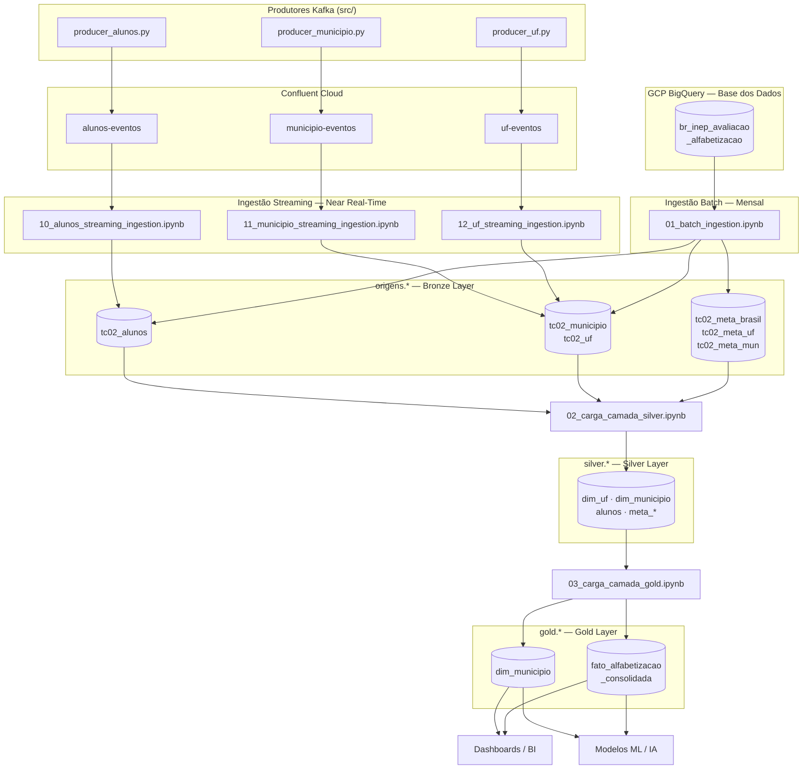

# Tech Challenge — Fase 2
## Pipeline Híbrido para Análise da Alfabetização no Brasil

Projeto desenvolvido por:

| Nome | |
|---|---|
| Carolina Yamada | |
| Igor Constantino | |
| Raphael Tavela | |
| Rodrigo do Vale | |
| Vinicius Miura | |

para o **Tech Challenge — Fase 2** do curso **Pós-Tech IA Scientist — FIAP**.

---

## Contexto do Problema

A alfabetização na infância é um dos pilares fundamentais para o desenvolvimento educacional, social e econômico do Brasil. O **Compromisso Nacional Criança Alfabetizada** mobiliza União, estados e municípios com a meta de que **todas as crianças brasileiras estejam alfabetizadas ao final do 2º ano do ensino fundamental até 2030**.

O **Indicador Criança Alfabetizada** (INEP / Pesquisa Alfabetiza Brasil, 2023) mede o percentual de alunos que atingem o ponto de corte de **743 pontos** na escala de proficiência do SAEB — limiar a partir do qual uma criança é considerada alfabetizada.

Compreender os fatores que influenciam esse indicador exige integrar diferentes fontes: metas nacionais e estaduais, dados territoriais, microdados educacionais e indicadores de desempenho municipal.

---

## O Desafio

Construir uma **pipeline híbrida de dados (Batch + Streaming)** capaz de integrar as fontes do indicador de alfabetização, garantindo **qualidade, escalabilidade e eficiência de custos** em ambiente de nuvem (Databricks + GCP + Confluent Cloud).

---

## Arquitetura da Solução

A pipeline segue a **Arquitetura Medalhão** em três camadas Delta Lake, com ingestão híbrida batch/streaming convergindo na mesma camada Bronze (`origens.*`):

```
┌─────────────────────────────────────────────────────────────────────┐
│  FONTES EXTERNAS                                                    │
│                                                                     │
│  GCP BigQuery (Base dos Dados / INEP)    Confluent Cloud (Kafka)    │
│  Tabelas: uf, municipio, alunos,         Tópicos:                   │
│           meta_brasil, meta_uf,          · alunos-eventos           │
│           meta_municipio, dicionario     · municipio-eventos        │
│                                          · uf-eventos               │
└────────────────────┬──────────────────────────────┬─────────────────┘
                     │  BATCH (mensal)              │  STREAMING (near real-time)
                     ▼                              ▼
┌─────────────────────────────────────────────────────────────────────┐
│  BRONZE — origens.* (Delta Lake, particionado por ano/mês)          │
│                                                                     │
│  tc02_alunos · tc02_municipio · tc02_uf · tc02_meta_brasil          │
│  tc02_meta_uf · tc02_meta_mun · tc02_dicionario                     │
└────────────────────────────────┬────────────────────────────────────┘
                                 │  02_carga_camada_silver.ipynb
                                 ▼
┌─────────────────────────────────────────────────────────────────────┐
│  SILVER — silver.* (Delta Lake)                                     │
│                                                                     │
│  tc02_dim_uf · tc02_dim_municipio · tc02_alunos                     │
│  tc02_meta_brasil · tc02_meta_uf · tc02_meta_municipio              │
└────────────────────────────────┬────────────────────────────────────┘
                                 │  03_carga_camada_gold.ipynb
                                 ▼
┌─────────────────────────────────────────────────────────────────────┐
│  GOLD — gold.* (Delta Lake — Modelo Kimball)                        │
│                                                                     │
│  dim_municipio (SK via xxhash64)                                    │
│  fato_alfabetizacao_consolidada                                     │
└──────────────────────────┬──────────────────────────────────────────┘
                           │
              ┌────────────┴─────────────┐
              ▼                          ▼
         Dashboards / BI          Modelos de ML / IA
```

### Diagrama de Fluxo de Dados



---

## Fontes de Dados

Dados obtidos da plataforma [Base dos Dados](https://basedosdados.org/) — conjunto `br_inep_avaliacao_alfabetizacao` via BigQuery:

| Tabela BigQuery | Destino Bronze | Atualização | Modo |
|---|---|---|---|
| `alunos` | `origens.tc02_alunos` | Contínua | Batch + **Streaming** |
| `municipio` | `origens.tc02_municipio` | Contínua | Batch + **Streaming** |
| `uf` | `origens.tc02_uf` | Contínua | Batch + **Streaming** |
| `meta_alfabetizacao_brasil` | `origens.tc02_meta_brasil` | Mensal | Batch |
| `meta_alfabetizacao_uf` | `origens.tc02_meta_uf` | Mensal | Batch |
| `meta_alfabetizacao_municipio` | `origens.tc02_meta_mun` | Mensal | Batch |
| `dicionario` | `origens.tc02_dicionario` | - | - |

As três tabelas com dados de medição (`alunos`, `municipio`, `uf`) recebem atualizações em near real-time (intervalos de 30 minutos) via Kafka, simulando a chegada de novos resultados de avaliação ao longo do período entre execuções batch.

---

## Estrutura do Repositório

```
tech-challenge-02/
├── src/
│   │
│   ├── # ── Pipeline Medalhão ──────────────────────────────────────
│   ├── 00_criacao_origens.ipynb          ← Inicializa tabelas Bronze (BigQuery + partições)
│   ├── 01_batch_ingestion.ipynb          ← Ingestão batch mensal (BigQuery → origens.*)
│   ├── 02_carga_camada_silver.ipynb      ← Limpeza, dedup, validação, integração → silver.*
│   ├── 03_carga_camada_gold.ipynb        ← Modelo dimensional Kimball → gold.*
│   │
│   ├── # ── Streaming ──────────────────────────────────────────────
│   ├── 10_alunos_streaming_ingestion.ipynb    ← Consumer: alunos-eventos → tc02_alunos
│   ├── 11_municipio_streaming_ingestion.ipynb ← Consumer: municipio-eventos → tc02_municipio
│   ├── 12_uf_streaming_ingestion.ipynb        ← Consumer: uf-eventos → tc02_uf
│   │
│   ├── # ── Produtores Kafka ────────────────────────────────────────
│   ├── producer_alunos.py                ← Gera e publica eventos de avaliação de alunos
│   ├── producer_municipio.py             ← Gera e publica indicadores municipais
│   ├── producer_uf.py                    ← Gera e publica indicadores por UF
│   │
│   ├── # ── Simuladores (executam os producers no Databricks) ───────
│   ├── simula_producer_alunos.ipynb
│   ├── simula_producer_municipio.ipynb
│   ├── simula_producer_uf.ipynb
│   │
│   ├── # ── Configuração dos producers ──────────────────────────────
│   ├── config_aluno.yaml
│   ├── config_municipio.yaml
│   └── config_uf.yaml
│
├── docs/
│   └── [IAST] - Tech Challenge - Fase 2.pdf
├── workflows/                            ← Definições de Databricks Workflows
│   │
│   ├── # ── Pipelines de execução ───────────────────────────────────
│   ├── bronze_batch_ingestion.yaml         ← Realiza a execução dos notebooks de ingestão em batch
│   ├── bronze_ingestao_streaming.yaml      ← Realiza a execução dos notebooks de ingestão em streaming
│   ├── run_batch_processing.yaml           ← Realiza a execução dos notebooks de processamento das camadas silver e gold
│
└── README.md
```

---

## Pré-requisitos e Configuração

### Infraestrutura necessária

| Componente | Serviço |
|---|---|
| Plataforma de processamento | Databricks (Serverless) |
| Armazenamento analítico | Delta Lake (nativo Databricks) |
| Fonte de dados históricos | GCP BigQuery + Service Account com acesso a `basedosdados` |
| Broker de mensagens | Confluent Cloud (Kafka gerenciado) |

### Databricks Secrets

Os notebooks leem credenciais exclusivamente via **Databricks Secrets** (sem arquivos de credencial no Workspace):

```bash
# Scope tc_02 — Confluent Cloud
databricks secrets put-secret --scope tc_02 --key api_key
databricks secrets put-secret --scope tc_02 --key api_secret
databricks secrets put-secret --scope tc_02 --key bootstrap_servers

# Scope tc_02_gcp — GCP BigQuery
databricks secrets put-secret --scope tc_02_gcp --key gcp_sa_json  # JSON completo da SA
```

### Tópicos Kafka (criar no Confluent Cloud)

| Tópico | Producer | Consumer |
|---|---|---|
| `alunos-eventos` | `producer_alunos.py` | `10_alunos_streaming_ingestion.ipynb` |
| `municipio-eventos` | `producer_municipio.py` | `11_municipio_streaming_ingestion.ipynb` |
| `uf-eventos` | `producer_uf.py` | `12_uf_streaming_ingestion.ipynb` |

---

## Execução do Pipeline

### Ordem de execução (primeira vez)

```
1. 00_criacao_origens.ipynb       ← Cria os schemas e tabelas particionadas
2. 01_batch_ingestion.ipynb       ← Popula a Bronze com dados históricos (BigQuery)
3. 02_carga_camada_silver.ipynb   ← Processa Bronze → Silver
4. 03_carga_camada_gold.ipynb     ← Processa Silver → Gold
```

### Streaming (em paralelo ao batch)

```
# No Databricks, execute em sessões separadas:
simula_producer_alunos.ipynb      ← publica eventos em alunos-eventos
simula_producer_municipio.ipynb   ← publica eventos em municipio-eventos
simula_producer_uf.ipynb          ← publica eventos em uf-eventos

# Consumers (leem os tópicos e gravam na Bronze):
10_alunos_streaming_ingestion.ipynb
11_municipio_streaming_ingestion.ipynb
12_uf_streaming_ingestion.ipynb
```

### Execução recorrente (mensal)

```
1. 01_batch_ingestion.ipynb       ← Reprocessa partição do mês corrente (Dynamic Overwrite)
2. 02_carga_camada_silver.ipynb
3. 03_carga_camada_gold.ipynb
```

---

## Tecnologias Utilizadas

| Tecnologia | Justificativa |
|---|---|
| **Databricks Serverless** | Plataforma unificada batch + streaming; pago por DBU consumido, sem cluster ocioso; suporte nativo a Delta Lake e Structured Streaming |
| **Delta Lake** | Implementação natural da Arquitetura Medalhão com ACID, Time Travel e Dynamic Partition Overwrite; armazenamento Parquet com metadados, 60–80% mais barato que CSV |
| **Apache Spark / Structured Streaming** | Motor distribuído; `trigger(availableNow=True)` processa eventos disponíveis e encerra o job — sem cluster sempre ativo |
| **Confluent Cloud (Kafka gerenciado)** | Broker de mensagens com alta disponibilidade, autenticação SASL_SSL e sem necessidade de operar infraestrutura Kafka |
| **GCP BigQuery + Base dos Dados** | Fonte autoritativa dos dados INEP; conector Spark nativo; credenciais via base64 da Service Account |
| **Databricks Secrets** | Gerenciamento seguro de credenciais sem expor segredos no código ou no Workspace |
| **Python / PySpark** | Linguagem principal; `confluent-kafka` para os producers; `xxhash64` para chaves substitutas determinísticas |

---

## Decisões Arquiteturais

### Batch vs Streaming

Os dados do INEP são publicados com frequência anual, tornando o **batch mensal** o mecanismo primário e mais custo-eficiente para dados históricos. O **streaming** complementa com ingestão near real-time de novas medições à medida que chegam — simulando um sistema de coleta contínua de resultados de avaliação.

A combinação usa `outputMode("append")` no streaming e `Dynamic Partition Overwrite` no batch: ambos convivem na mesma tabela Bronze sem conflito, pois o batch reescreve apenas a partição do mês corrente e o streaming acrescenta novos registros à mesma partição.

### Tabelas com ingestão híbrida vs batch exclusivo

| Tabela | Justificativa |
|---|---|
| `alunos`, `municipio`, `uf` | Medições que chegam continuamente → streaming + batch |
| `meta_*`, `dicionario` | Metas anuais e tabelas de referência → batch mensal suficiente |

### `trigger(availableNow=True)` em vez de streaming contínuo

Cada job de streaming processa todos os eventos disponíveis no tópico e encerra, em vez de manter um cluster em execução permanente. Isso reduz o custo de streaming em ~90% para volumes não-contínuos, mantendo a semântica de exatamente-uma-vez do Structured Streaming.

### Delta Lake vs Data Warehouse clássico

Delta Lake foi escolhido por:
- ACID nativo com Parquet (sem custo de DW gerenciado)
- Time Travel para auditoria e reprocessamento
- Dynamic Partition Overwrite para reprocessamentos idempotentes
- Integração direta com o Databricks SQL Warehouse para consumo analítico

### Modelo Kimball na Gold Layer

A camada Gold adota o modelo dimensional Kimball com:
- **Chaves substitutas (SK)** via `xxhash64` — determinísticas, sem dependência de sequência, seguras para reprocessamento
- **Broadcast joins** para dimensões pequenas — elimina shuffle em joins com fatos grandes
- **Separação clara** entre dimensões (`dim_municipio`) e fatos (`fato_alfabetizacao_consolidada`)

---

## Qualidade de Dados

Implementada diretamente no notebook Silver (`02_carga_camada_silver.ipynb`):

| Verificação | Implementação |
|---|---|
| **Deduplicação** | `dropDuplicates` por chaves de negócio em cada entidade |
| **Valores ausentes** | `dropna` em campos críticos (`ano`, `id_municipio`, `sigla_uf`, etc.) |
| **Normalização de tipos** | Cast explícito para `IntegerType`, `DoubleType`, padronização de strings (`trim`, `upper`) |
| **Validação de range** | `filter` em `taxa_alfabetizacao.between(0, 100)`, `percentual_participacao.between(0, 100)` |
| **Preenchimento de nulos** | `fillna(0.0)` em colunas de proporção (`proporcao_aluno_nivel_*`) |
| **Relatório de qualidade** | Gerado ao final do notebook Silver: contagem bronze vs silver, duplicatas removidas, nulos por coluna, violações de range |

---

## Monitoramento e FinOps

### Monitoramento

- **Databricks Job Runs**: histórico de execuções com duração, status, logs e alertas nativos
- **Metadados de rastreabilidade** em todas as tabelas: `_data_criacao_origem`, `_ano_ingestao`, `_mes_ingestao`, `_data_processamento`
- **Relatório de qualidade Silver**: impresso a cada execução com métricas de completude, duplicatas e integridade referencial
- **`query.status`** ao final de cada job de streaming: confirma lotes processados e eventuais erros

### FinOps

| Prática | Implementação | Impacto |
|---|---|---|
| **Serverless para batch** | `00` a `03` rodam em Databricks Serverless | Sem custo de cluster ocioso |
| **`trigger(availableNow=True)`** | Jobs de streaming encerram após processar eventos disponíveis | ~90% de redução vs streaming contínuo |
| **Delta Lake / Parquet** | Formato padrão em todas as camadas | 60–80% menos espaço que CSV |
| **Dynamic Partition Overwrite** | Reprocessamentos sobrescrevem apenas a partição do mês, não a tabela inteira | Reduz I/O e tempo de execução |
| **Particionamento por `_ano_ingestao` / `_mes_ingestao`** | Queries filtradas por período leem apenas partições necessárias | Prune automático de partições |
| **Broadcast joins** | Dimensões pequenas (`dim_municipio`, `dim_uf`) são broadcast | Elimina shuffle custoso |
| **`xxhash64` para SKs** | Geração determinística de surrogate keys sem sequência gerenciada | Sem custo de estado distribuído |
| **Databricks Secrets** | Credenciais fora do código e do Workspace | Sem overhead de gestão de arquivos |

---

## Aplicação em Inteligência Artificial

A camada Gold está estruturada para alimentar diretamente modelos de ML e análises avançadas:

### Predição do Indicador de Alfabetização por Município

- **Features**: `rede`, `serie`, `ano`, `media_portugues` histórica, `proporcao_aluno_nivel_*`, gap em relação à meta
- **Target**: `taxa_alfabetizacao` ou classificação binária (acima/abaixo da meta)
- **Algoritmos sugeridos**: XGBoost, Random Forest, LightGBM

### Análise de Cluster de Vulnerabilidade Educacional

- Agrupa municípios com perfis similares: baixo indicador + baixa meta + rede municipal + interior
- Subsidia a priorização de políticas públicas de intervenção
- **Algoritmos**: K-Means, DBSCAN sobre `fato_alfabetizacao_consolidada`

### Detecção de Municípios em Risco

- Identifica municípios com maior gap em relação à meta projetada 2024/2025
- Permite geração de alertas antecipados para gestores educacionais
- Dataset base: `gold.fato_alfabetizacao_consolidada` com campos `meta_alfabetizacao_projetada` e `taxa_alfabetizacao`

### Evolução Temporal e Séries Históricas

- O particionamento por `_ano_ingestao` / `_mes_ingestao` preserva o histórico completo de ingestões
- Permite treinar modelos de série temporal (LSTM, Prophet) sobre a evolução do indicador
- Time Travel do Delta Lake permite reconstruir estados anteriores da base para backtesting

---

*Pós-Tech IA Scientist — FIAP | Tech Challenge Fase 2*
